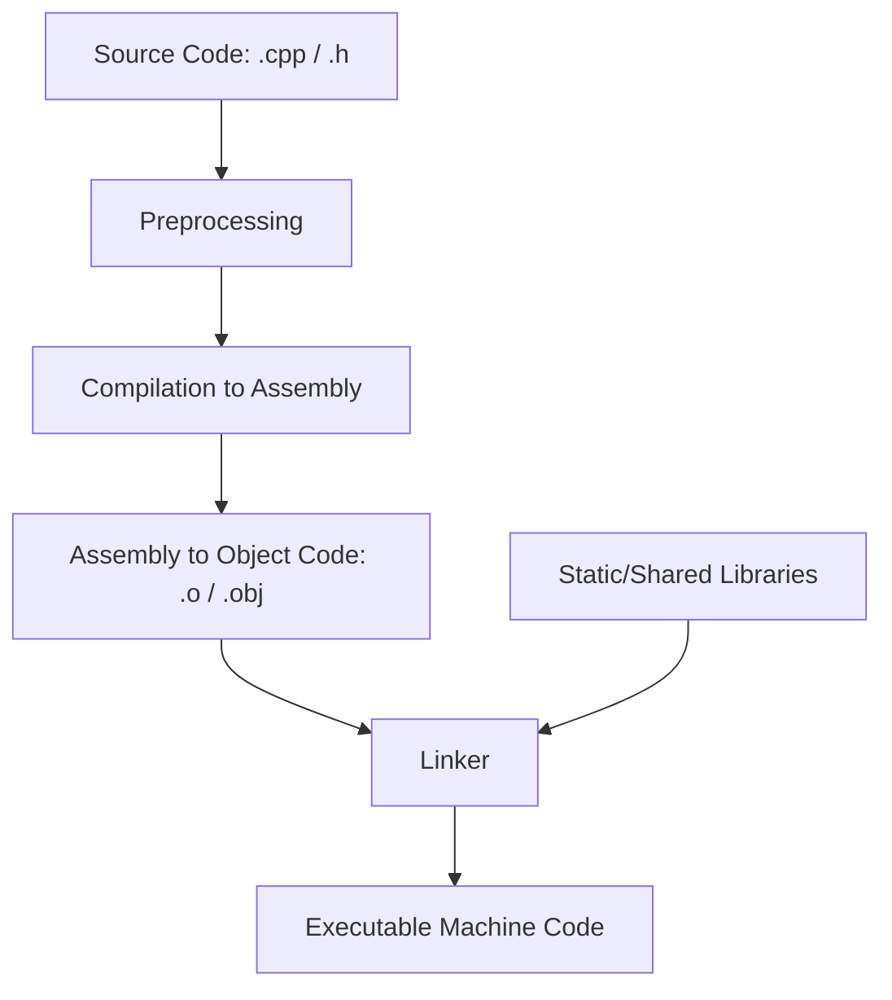

# How to Compile C++ Code: A Beginner's Guide

C++ is a compiled language, which means that before your computer can run the code you write, it must be translated from human-readable text into machine code (binary files) by a program called a compiler. Understanding how compilers translate and link files is a fundamental milestone for any software developer.

This guide covers the core compilation pipeline, compiler installation across platforms, and direct compilation commands using standard command-line tools.

---

## 1. The C++ Compilation Lifecycle

When you trigger a build command for a C++ source file (e.g., `main.cpp`), the compiler performs several distinct phases:



### A. Preprocessing
The preprocessor scans the code for directives beginning with the `#` symbol (e.g., `#include` or `#define`). It resolves macro substitutions and copies the headers (like `<iostream>`) directly into the translation unit file.

### B. Compilation
The compiler parses the preprocessed source code and translates it into platform-specific assembly language instructions.

### C. Assembly
The assembler takes the assembly code and translates it into binary machine instructions (machine code). The resulting output is called an **object file** (with extensions like `.o` on macOS/Linux or `.obj` on Windows).

### D. Linking
The linker merges all compiled object files and any external static or shared libraries (e.g., standard math utilities) into a single, cohesive executable binary.

---

## 2. Setting Up Your Compiler Environment

To compile C++ code, you must install a toolchain containing a standard C++ compiler:

### macOS
The easiest method is installing the Xcode Command Line Tools, which provide `clang++`:
```bash
xcode-select --install
```

### Linux (Ubuntu/Debian)
Install the `build-essential` meta-package containing the GNU Compiler Collection (`g++`):
```bash
sudo apt update
sudo apt install build-essential
```

### Windows
- **MinGW-w64**: A lightweight port of GCC for Windows. You can install it using a package manager like Chocolatey (`choco install mingw`) or via MSYS2.
- **MSVC**: The Microsoft Visual C++ compiler, bundled with Visual Studio.

---

## 3. Compiling a Simple "Hello, World" Program

Let's write a simple `hello.cpp` program:

```cpp
#include <iostream>

int main() {
    std::cout << "Hello, SciCalcX Compiler Workspace!" << std::endl;
    return 0;
}
```

To compile this code, open your terminal/command prompt, navigate to the folder containing your file, and run:

```bash
g++ hello.cpp -o hello
```

### Breakdown of the Compilation Flags:
* `g++`: Calls the GNU C++ compiler wrapper.
* `hello.cpp`: The source code input file.
* `-o hello`: Specifies the output binary name. If omitted, the default executable name will be `a.out` (or `a.exe` on Windows).

Run the executable to verify:
```bash
# On Linux/macOS:
./hello

# On Windows:
hello.exe
```

---

## 4. Advanced Compiler Flags You Should Know

To write high-quality software, make use of additional compiler arguments:

| Flag | Purpose | Recommended Usage |
|------|---------|-------------------|
| `-std=c++17` / `-std=c++20` | Specifies the C++ language standard version to use. | `g++ -std=c++20 main.cpp -o app` |
| `-Wall` | Enables a set of common diagnostic compiler warning indicators. | Highly recommended during development. |
| `-Wextra` | Enables additional stylistic and logical warnings not covered by `-Wall`. | Helps identify potential logic bugs early. |
| `-O2` / `-O3` | Enables intermediate and high-level build optimizations for runtime speed. | Use for production deployment builds. |
| `-g` | Appends debugging symbols to the binary file for debug diagnostics (GDB / LLDB). | Essential for debugging memory exceptions. |

### Example Compilation Command with Warnings and Optimizations:
```bash
g++ -std=c++20 -Wall -Wextra -O2 main.cpp -o my_app
```

---

## 5. Bridging Math and Code with SciCalcX

If you are a student or developer working with complex mathematical formulas, you can prototype your mathematical models using the SciCalcX Scientific or Calculus workspace, verify the numeric precision, and immediately draft your logic in the interactive **AI Code Tutor/Compiler** workspace to see how it executes under a real compiler environment.
